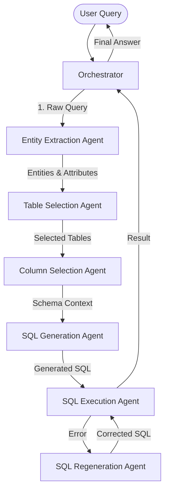

# IRIS: Intelligent Retail Insights System

IRIS is a GenAI-powered Retail Insights Assistant that enables conversational analytics over large-scale retail sales data. It uses a scalable, multi-agent architecture to convert natural language queries into SQL, execute them against a database, and provide actionable insights.


---

## 1. Agent Architecture

IRIS is built using the **Google Agent Development Kit (ADK)**. The system is composed of specialized agents, each responsible for a specific stage of the Text-to-SQL pipeline.

### The Agents

| Agent Name | Role & Responsibility |
| :--- | :--- |
| **Orchestrator** | The central brain. It inherits from `CustomBaseAgent` and manages the sequential execution flow, passing data between other agents and handling error loops. |
| **Entity Extraction** | Analzyes the user's natural language query to extract key entities (e.g., "Mumbai", "Amazon") and attributes (e.g., "total amount", "shipped"). |
| **Table Selection** | Uses **FAISS** vector search (embedding-based) to identify the most relevant database tables for the query based on the extracted entities. |
| **Column Selection** | Performs a granular vector search to find specific columns within the selected tables that match the query attributes. |
| **SQL Generation** | Uses the selected schema context (Table names + Column descriptions) to generate a syntactically correct SQL query (SQLite dialect). |
| **SQL Execution** | Connects to the SQLite database, executes the generated query, and returns the results. |
| **SQL Regeneration** | If execution fails, this agent analyzes the error message and the previous SQL to generate a corrected query. |

---

## 2. How the Agents Connect

The agents operate in a **Sequential Workflow** managed by the Orchestrator.



1.  **Input**: User asks a question (e.g., "Total sales in Mumbai?").
2.  **Extraction**: Entities ('Mumbai') and Attributes ('Total sales') are extracted.
3.  **Retrieval**:
    *   `TableSelection` finds tables related to 'sales' and 'shipment'.
    *   `ColumnSelection` finds columns like `Amount` and `Ship-City`.
4.  **Generation**: LLM generates SQL: `SELECT SUM(Amount) FROM orders WHERE City = 'Mumbai'`.
5.  **Execution**: Query executes. If it fails (e.g., wrong column name), `SQLRegeneration` fixes it.
6.  **Output**: Final result is returned.

---

## 3. Technology Stack

*   **Language**: Python 3.10+
*   **Agent Framework**: [Google ADK (Agent Development Kit)](https://pypi.org/project/google-adk/)
*   **LLM & Embeddings**:
    *   **Google GenAI SDK (v2)** (`google-genai`): Access to Gemini Flash models.
    *   **Model**: `gemini-1.5-flash` (Generation), `text-embedding-004` (Embeddings).
*   **Vector Database**:
    *   **FAISS** (`faiss-cpu`, `langchain-community`): Local vector storage for table/column schema embeddings.
*   **Database**: SQLite (`sqlite3`).
*   **Environment Management**: Conda.

---

## 4. File Structure

```text
D:\IRIS\
├── Database/                   # SQLite Database
│   └── iris.db                 # The main retail data
├── Sales Dataset/              # Raw and Processed Data
├── faiss_db/                   # Local Vector Indicies (FAISS)
│   ├── table_descriptions/     # Index for Table search
│   └── columns_*/              # Indices for Column search per table
├── secrets/
│   └── .env                    # API Keys (GEMINI_API_KEY)
├── src/
│   ├── agents/                 # Agent Definitions
│   │   ├── base_agent.py       # Custom Base Classes (ADK wrapper)
│   │   ├── entity_extraction/  # Logic & Config for Extraction
│   │   ├── table_selection/    # Logic & Config for Table Search
│   │   ├── column_selection/   # Logic & Config for Column Search
│   │   ├── sql_generation/     # Logic & Config for SQL Writing
│   │   ├── sql_execution/      # Logic & Config for SQL Running
│   │   └── sql_regeneration/   # Logic & Config for Error Fixing
│   ├── database/               # Database Connectors
│   ├── embeddings/             # Gemini Embedding Wrapper
│   ├── vector_store/           # FAISS Store Wrapper
│   └── orchestrator.py         # Main entry point / Pipeline manager
├── tests/                      # Verification Scripts
│   └── verify_adk_agents.py    # End-to-End Test Script
├── import_data.py              # Script to load CSV -> SQLite
├── ingest_vectors.py           # Script to load metadata -> FAISS
└── requirements.txt            # Python Dependencies
```

---

## 5. Steps to Reproduce

### Prerequisites
*   Anaconda or Miniconda installed.
*   A Google Cloud Project with a Gemini API Key.

### 1. Clone the Repository
```bash
git clone https://github.com/novoforce/IRIS.git
cd IRIS
```

### 2. Setup Environment
Create and activate the conda environment:
```bash
conda create -n iris python=3.10 -y
conda activate iris
pip install -r requirements.txt
```

### 3. Configure Credentials
Create a file `secrets/.env` and add your API key:
```env
GEMINI_API_KEY=your_actual_api_key_here
```

### 4. Initialize Database (If starting from scratch)
*Note: The repo may already contain the DB. If not:*
1.  **Import Data**: Load raw CSVs into SQLite.
    ```bash
    python import_data.py
    ```
2.  **Ingest Vectors**: Create FAISS indices from the data schema.
    ```bash
    python ingest_vectors.py
    ```

### 5. Run the System
You can test the agents using the verification script:
```bash
python tests/verify_adk_agents.py
```
Or use the orchestrator in your own script:
```python
from src.orchestrator import Orchestrator

app = Orchestrator()
result = app.run("How many orders were shipped to Mumbai?")
print(result)
```